# MealMate 🍽️

MealMate is a campus dining coordination platform built specifically for university students. The app helps students find friends to eat with, discover dining plans happening around campus, share reviews, and stay connected through meal-based social interactions.

## Problem

University students often struggle to coordinate meal plans because of different class schedules, extracurricular activities, and busy routines. Many students end up eating alone despite wanting company.

MealMate solves this problem by allowing students to share when and where they are eating and instantly connect with others who want to join.

---

## Features

### User Authentication

* Secure signup and login using Firebase Authentication
* Persistent user sessions
* User profiles stored in Firestore

### Profile Management

* Edit profile information
* Upload profile picture
* Add bio, major, and graduation year
* View meal history

### Meal Creation

* Create dining plans
* Select meal location
* Select meal time
* Choose meal visibility

  * Friends Only
  * Public Campus
* Add dining preferences and notes

### Meal Discovery

* Friends Feed
* Campus Explore Feed
* Real-time meal updates
* Join meals instantly

### Meal Management

* Join meals
* Leave meals
* Delete meals you created
* Automatic meal expiration after 24 hours

### Social Features

* Send friend requests
* Accept or decline friend requests
* Unfriend existing friends
* View friend profiles

### Meal Chat

* Dedicated chat for every meal
* Real-time messaging using Firebase
* Group conversations for attendees

### Notifications

* Friend request notifications
* Friend acceptance notifications
* Meal join notifications
* Meal chat notifications

### Dining Reviews

* Daily food reviews
* Long-term dining hall reviews
* Dining hall leaderboard
* Community-driven recommendations

### Mahindra University Integration

Supported dining locations:

#### Dining Halls

* IT Mess
* Main Mess
* Girls Mess

#### Hangout & Snack Areas

* Café Adda
* Coffee Talk
* SOM Canteen

### Menu System

* Daily Mahindra University menu support
* Menu card accessible from the home screen
* Designed to support weekly menu uploads

---

## Tech Stack

### Frontend

* React Native
* Expo SDK 54
* TypeScript

### Backend

* Firebase Authentication
* Cloud Firestore

### State Management

* React Context API

### Navigation

* React Navigation

### Media

* Expo Image Picker

---

## App Screenshots

### Get Started
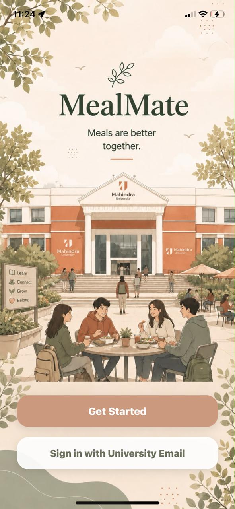

### Home Feed
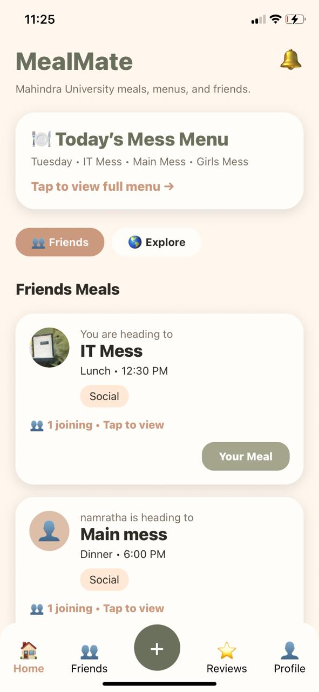

### Create Meal
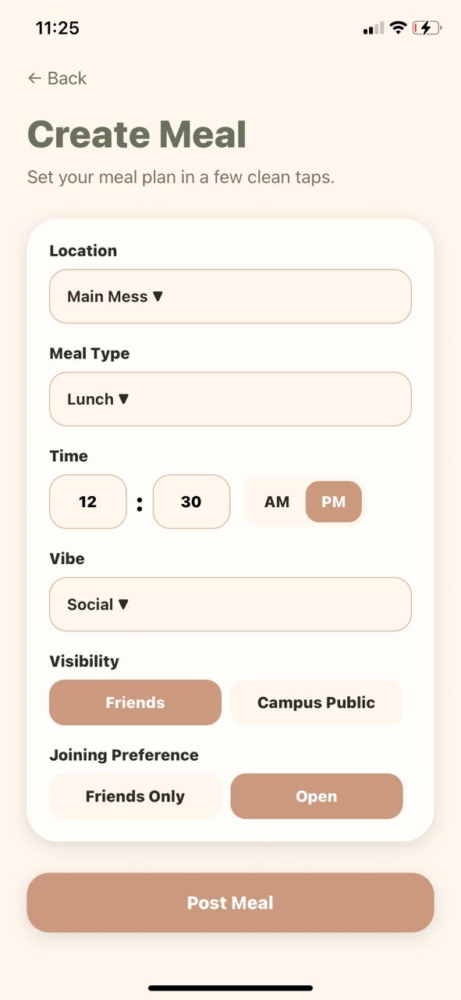

### Daily Menu
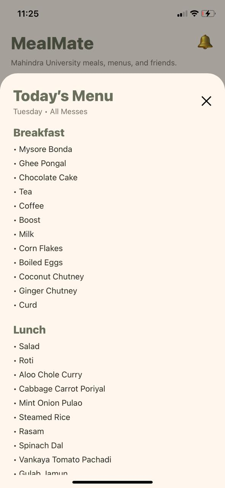

### Meal Details
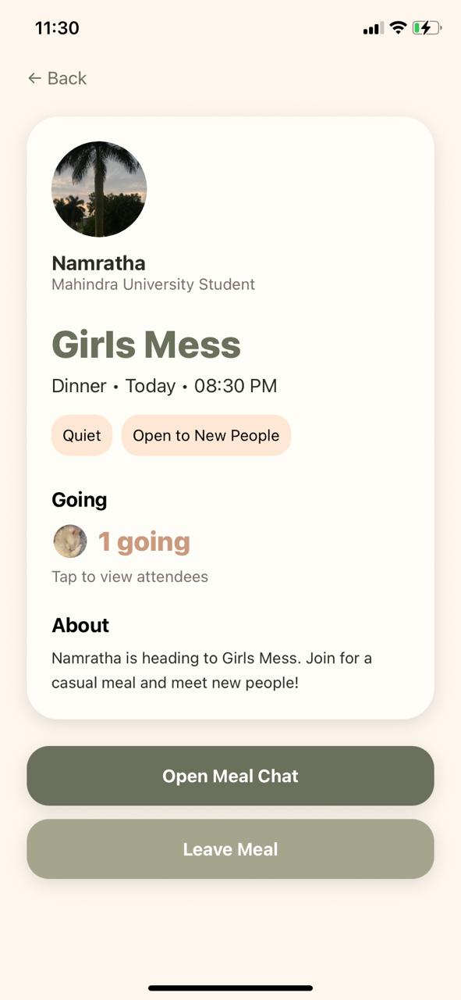

### Meal Chat
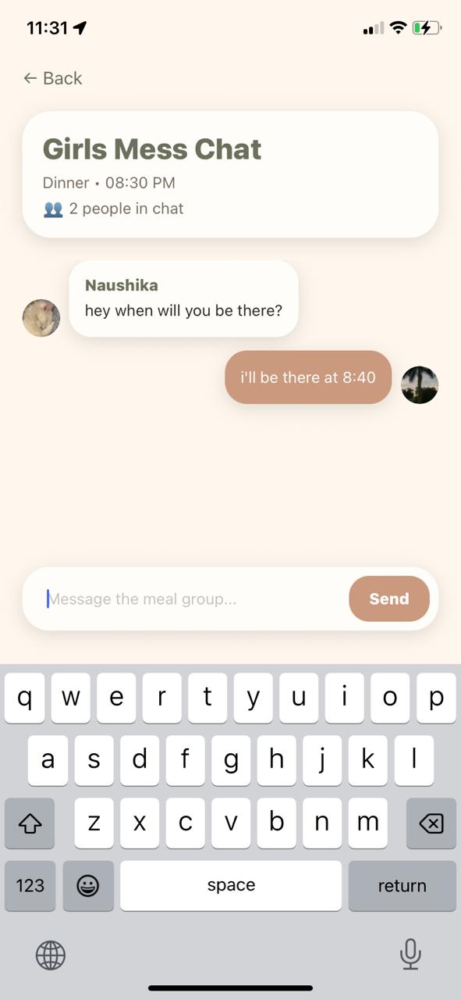

### Friends
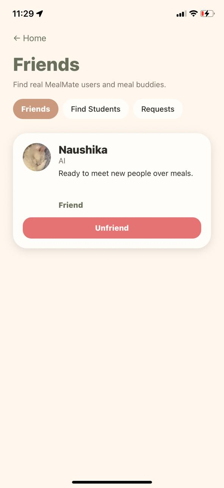

### Notifications
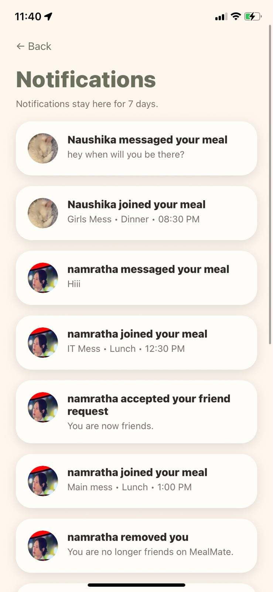

### Daily Reviews
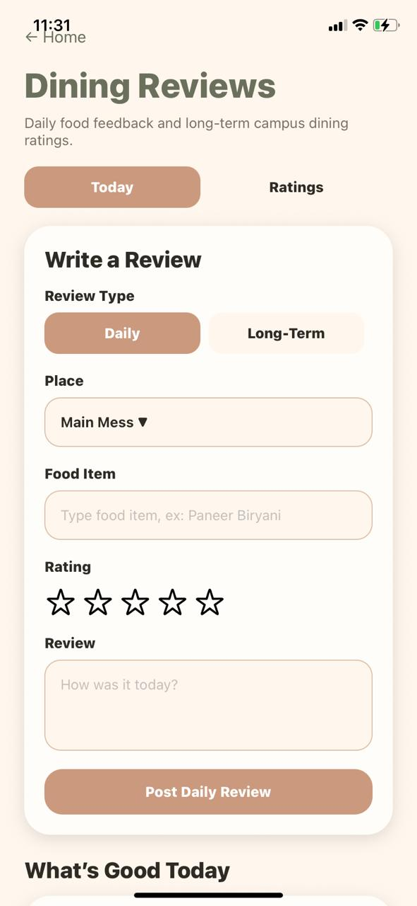

### Long-Term Dining Hall Rankings
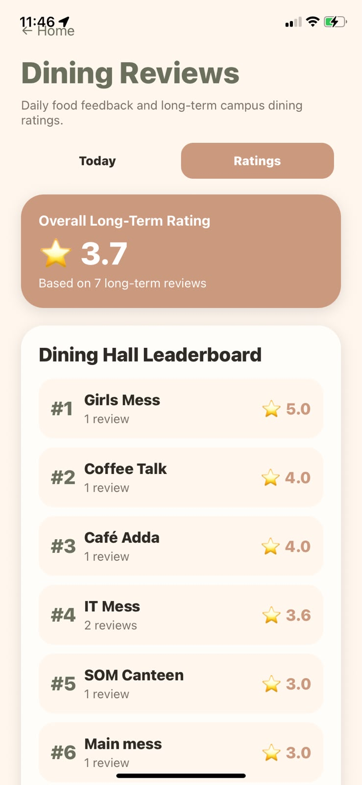

### Profile
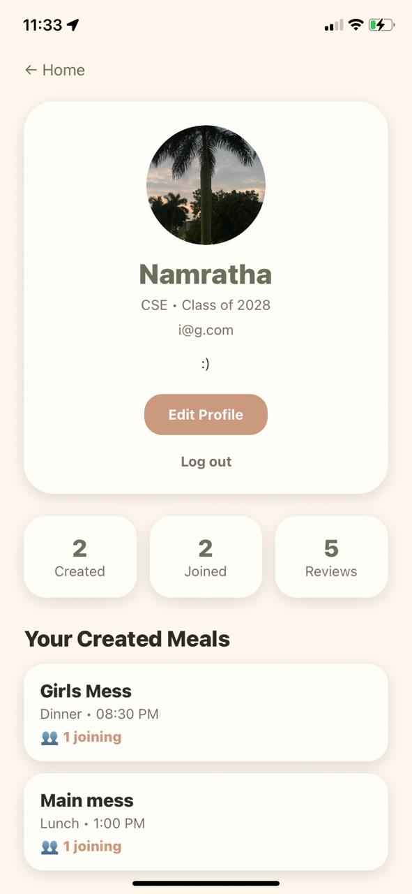

## Future Improvements

* Push notifications
* Dining hall occupancy tracking
* Smart friend recommendations
* AI-powered meal suggestions
* Event-based meal coordination
* QR-based friend adding
* Dining hall analytics dashboard
